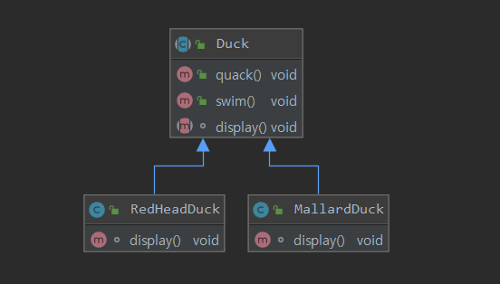
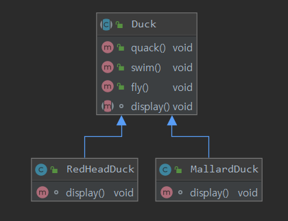
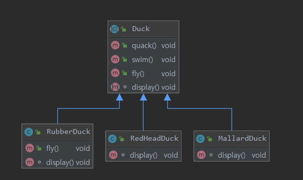

# HeadFirst Design Pattern

## Chapter1. 디자인패턴의 세계에 오신것을 환영합니다.
- 이 챕터에서는 디자인패턴이 필요한 이유와 기본적인 설계 방향에대해 공부한다.

### 1. 디자인패턴 소개
- 객체지향 디자인 원칙을 살펴 보고, 한가지 패턴을 직접 살펴보면서 어떤식으로 작동하는지 알아보자.

1.1 Duck 클래스 생성 
- Duck이라는 슈퍼 클래스와 Duck을 상속받아 MallardDuck RedheadDuck 이라는 서브클래스 생성.

* 
 

1.2 Duck 클래스에 메서드 추가
- fly 라는 기능을 추가하기 위해 메서드 생성
* 

1.3 Duck의 서브클래스에 문제 발생
- fly 메서드가 생기므로써 mallardDuck과 RedheadDuck에서는 쉬운 확장이 가능했지만 만약 rubberDuck( 고무오리 ... )이라는 클래스가 Duck 클래스를 상속 받고있다면?
* 

1.4 인터페이스로 사용
- 고무오리에 fly를 아무것도 안하게끔 상속받아 처리하려 했지만, 상황에따라 오버라이드 될 수있고 유지보수가 힘들어짐
- 따라서 인터페이스를 사용하여 Duck의 행동을 추상화하며, 추가된 기능은 새로 클래스를 생성하여 서브클래스에서 "구현" 하여 사용
* 

1.5 