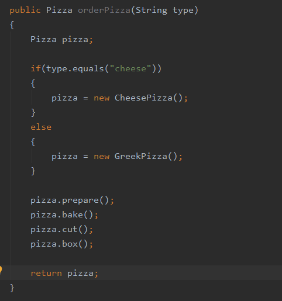
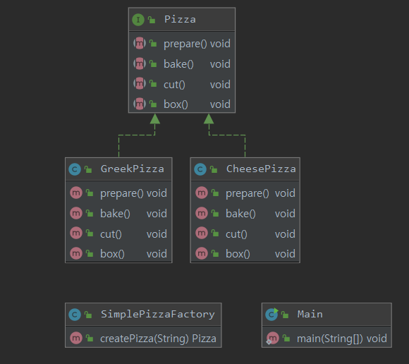

# Design-pattern

## 4. 팩토리 패턴

### 피자가게 구현과 문제점

* 메뉴가 변경되거나 바뀌었을 때, 해당 코드를 계속해서 바꿔줘야 한다.
* 캡슐화가 충분히 되어있지 않음. orderPizza 인데 피자의 종류가 추가되거나 변경되었을 때, 주문 자체의 코드를 바꿔야한다.
* 따라서 팩토리를 만들어 타입별로 선언부를 캡슐화하자

### 피자 생성부분 캡슐화.

* SimplePizzaFactory 를 구현하여 피자 생성 부분 캡슐화.
* 타입이 추가되거나 변경되어도 Factory부분만 변경하면 됨
