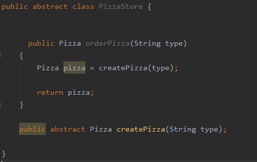
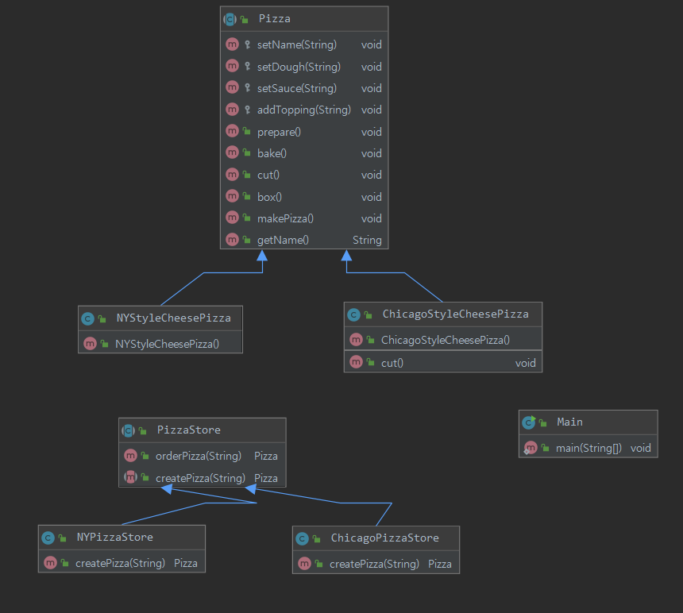
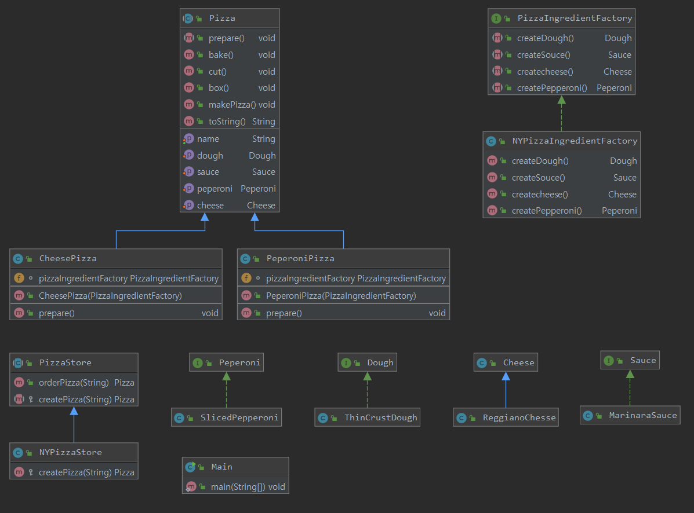

# Design-pattern

## 4. 팩토리 패턴


### 피자가게 구현과 문제점

* 메뉴가 변경되거나 바뀌었을 때, 해당 코드를 계속해서 바꿔줘야 한다.
* 캡슐화가 충분히 되어있지 않음. orderPizza 인데 피자의 종류가 추가되거나 변경되었을 때, 주문 자체의 코드를 바꿔야한다.
* 따라서 팩토리를 만들어 타입별로 선언부를 캡슐화하자


### 피자 생성부분 캡슐화.

* SimplePizzaFactory 를 구현하여 피자 생성 부분 캡슐화.
* 타입이 추가되거나 변경되어도 Factory부분만 변경하면 됨


### 피자가게 프레임워크
> 피자가게와 피자제작과정 전체를 하나로 묶어주는 프레임워크를 만들기로함


* 추상클래스로 선언하여 제어를 자식에게 역전시키는 프레임워크. 
* 자식은 다른거 신경 쓸것 없이  피자 생성하는 부분에만 신경쓰면 됨.
* 피자 가게별로 다양한 방법으로 피자 생상 가능.


* 다이어그램에 표현되지 않지만 피자가게별 / 피자종류별 클래스가 어마무시하게 생성된다.
* 시카고 피자에서 cut을 상속받아 재정의 하는것도 맘에 안들어 ..


###팩토리 메서드 패턴

```
팩토리 메서드 패턴에서는 객체를 새성하기 위한 인터페이스를 정의하는데, 
어떤 클래스의 인스턴스를 만들지는 서브클래스에서 결정하게 만듭니다 .
```
* 의존성 역전의 원칙 : 추상화를 강조하며, 고수준 구성요소가 저수준 구성요소에 의존하면 안돼고. 항상 추상화에 의존하도록 해야한다.


### 다시 피자가게로..
* 가이드라인
    * 어던 변수에도 구상 클래스에 대한 래퍼런스를 저장하지 맙시다
    * 구상 클래스에서 유도된 클래스를 만들지 맙시다
    * 베이스 클래스에 이미 구현되어 있던 메소드를 오버라이드 하지 맙시다 
    

* 피자와 피자가게와 재료공장과의 느슨한 결합
* 추상 메서드 패턴을 활용 