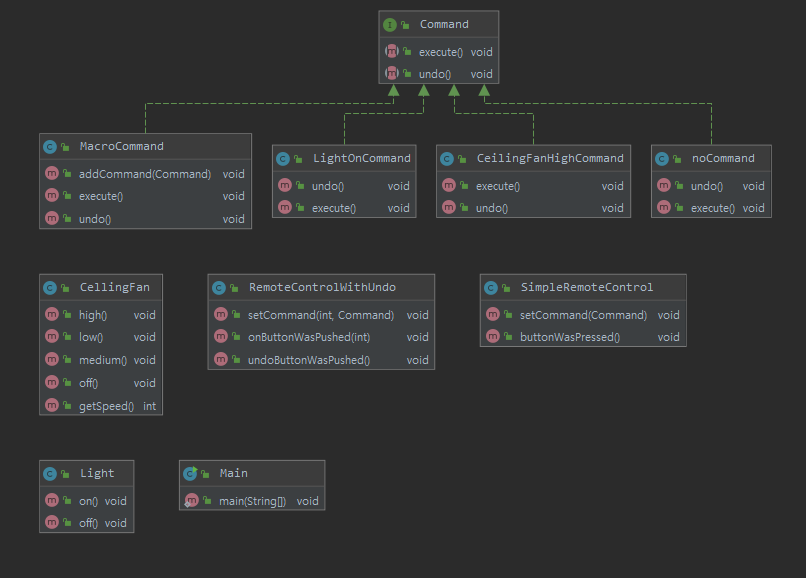

# Design-pattern

## 4. 팩토리 패턴

#### 객체마을 식당 등장인물 및 그 역할
    - 주문서는 주문한 메뉴를 캡슐화
    - 웨이트리스는 주문서를 받아서 거기에 있는 orderUp() 메서드를 호출
        - takeOrder()을 통해 여러 고객이 여러 주문서를 매개변수로 전달
    - 주방장은 식사를 준비하는데 필요한 정보를 가지고 있음
        * 웨이트리스가 orderUp() 메서드를 호출 하면 주방장이 그 주문을 받아서 음식을 만들기 위한 메서드를 처리
        
    

#### 객체마을 식당과 커맨드 패턴

1. 클라이언트에서 커맨드 객체 생성
2. setCommand() 를 호출하여 인보커에 커맨드 객체를 저장
3. 나중에 클라이언트에서 인보커한테 그 명령을 실행히켜 달라는 요청을 함


#### 첫번째 커맨드 객체


* Commnad 인터페이스를 상속받은 커맨드 객체 LightOnCommand
    * LightOnCommand에는 기능이 정의되어 있음(불키기) (손님)
* SimpleRemoteControl에서 해당 기능을 입력받음 (웨이트리스)
* Main인 SimpleRemoteControl에서 Command를 set 실제 호출 ( 요리사 )
* 포인트는 SimpleRemoteControl에선 Command가 어떤일 하는지는 정확하게 모르지만 execute()를 호출하면
요구사항이 처리된다는 것을 암


#### 커맨드 패턴의 정의
```text
커맨드 패턴을 이용하며 요구 사항을 객체로 캡슐화 할 수 있으며, 
매개변수를 써서 여러가지 다른 요구 사항을 집어넣을 수도 있습니다. 
```

#### undo 가 구현된 Command 패턴


* undo는 해당 기능을 롤백하는 기능
* NoCommand는 Null객체며 객체에 대해 null로 표현하기 위해 사용
* main에서 커맨드를 등록하고 해당 기능들에 동작 후 undo하면 해당 기능을 취소함


#### 리모컨에 파티모드

* 모든 기능을 한번에 처리하는 marcoCommand
* command를 리스트로 받아 한번에 처리