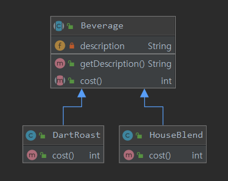
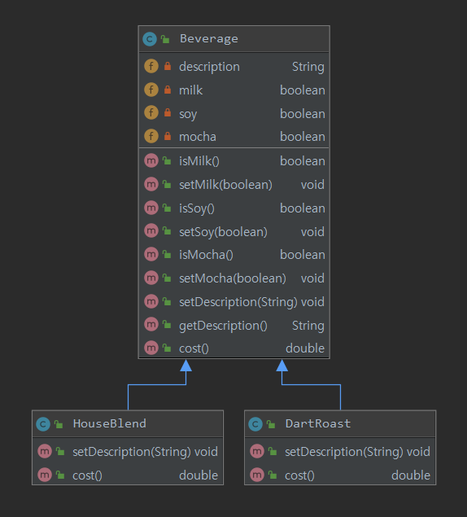
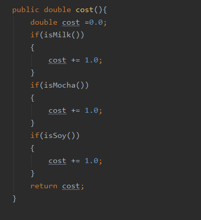
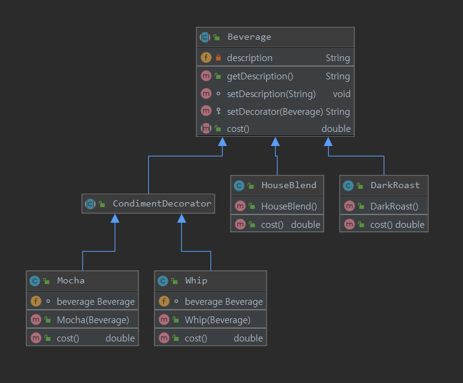

# Headfirst Disign Pattern

## 3. 데코레이터 패턴

#### 1 스타버즈 구현
* 
* beverage 란 추상클래스에서 cost라는 추상 메서드를 서브클래스에서 구현하는 형태.
* cost는 커피마다 달라 질 수 있음
* 데코가 추가될 때마다 부모를 상속받은 클래스를 구현
* 커피에 데코 생길때 마다 계속해서 상속받아 구현 -> 클래스가 많아질 수 있다

#### 2 스타버즈 수정
* 
* 데코가 추가 될때마다 계속해서 부모클래스를 상속받던 문제 수정
    * 데코가 있는지 없는지를 체크하기 위해 데코에 대한 첨가 여부를 파악하는 변수와 get/set 메서드를 구현
    * cost에서 데코가 있는지 파악하여 가격을 계산하여 리턴
    * 
* 꼴뵈기 싫은 코드 완성
    * 데코 종류가 추가될 때마다 코스트 다시 계산해줘야함
    * 기존 코드를 건들이지 않은 채로..  확장할 수 있어야 한다


### ***잠깐 거쳐가며.. 책 123p를 보자
```
서브클래스를 만드는 방식으로 행동을 상속받으면, 그 행동을 컴파일시에 완전히 결정 됩니다. 
게다가 모든 서브클래스에서 똑같은 행동을
상속 받아야 합니다. 하지만 구성을 통해서 객체의 행동을 확장하면 실행중에 동적으로 행동을 설정 할 수 있습니다.
```
* 
* 위 코드에서는 구성에서 행동을 결정하고 있다. 
* 서브클래스에서 위 메서드를 그대로 상속받아야 하며, 새로운 기능을 추가해야 할 때, 기존 코드를 수시로 건들여야한다.
* 하지만 *뒤에서 배울 데코레이터 패턴*을 통해 구성을 통해 런타임단에서 모든것을 결정하게 한다면 기존코드를 건들이지 않고 
수시로 확장이 가능하다

#### 3. OCP : open closed principal
```
ocp : 클래스는 확장에 대해서는 열려 있어야 하며, 코드 변경에 대해서는 닫혀 있어야 한다.
```
* 하지만 모든 코드에서 기존 코드를 수정하지 않고 확장하는일은 굉장히 어려운일임
* 따라서 우리는 디자인한 것중 가장 바뀔 확률이 높을것을 잘 살펴보고, 원칙을 작용하는 것이 중요


#### 4. 데코레이터 패턴
```text
데코레이터 패턴에서는 객체에 추가적인 요건을 동적으로 첨가한다. 
데코레이터는 서브클래스를 만드는 것을 통해서 기능을 유연하게 확장할 수 있는
방법을 제공한다.
```

* 