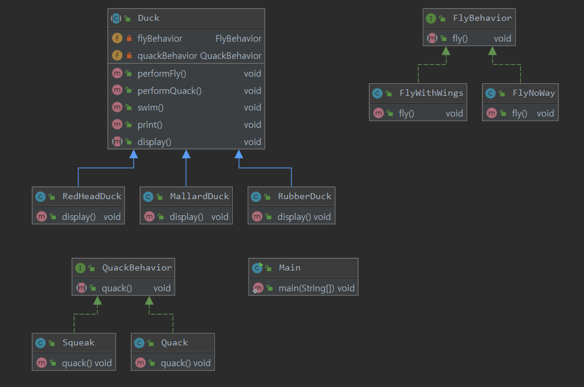

# HeadFirst Design Pattern

## Chapter1. 디자인패턴의 세계에 오신것을 환영합니다.
- 이 챕터에서는 디자인패턴이 필요한 이유와 기본적인 설계 방향에대해 공부한다.


###  디자인패턴 소개
- 객체지향 디자인 원칙을 살펴 보고, 한가지 패턴을 직접 살펴보면서 어떤식으로 작동하는지 알아보자.

* Duck 클래스 생성 
    * Duck이라는 슈퍼 클래스와 Duck을 상속받아 MallardDuck RedheadDuck 이라는 서브클래스 생성.

 
 


* Duck 클래스에 메서드 추가
    * fly 라는 기능을 추가하기 위해 메서드 생성
    
 


* Duck의 서브클래스에 문제 발생
    * fly 메서드가 생기므로써 mallardDuck과 RedheadDuck에서는 쉬운 확장이 가능했지만 만약 rubberDuck( 고무오리 ... )이라는 클래스가 Duck 클래스를 상속 받고있다면?

 


* 인터페이스로 사용
    * 고무오리에 fly를 아무것도 안하게끔 상속받아 처리하려 했지만, 상황에따라 오버라이드 될 수있고 유지보수가 힘들어짐
    * 따라서 인터페이스를 사용하여 Duck의 행동을 추상화하며, 추가된 기능은 새로 클래스를 생성하여 서브클래스에서 "구현" 하여 사용


#### 문제점을 파악해보자
> * 위와같이 인터페이스를 이용하여 queck과 fly를 추상화 하였다. 하지만 이렇게 하면 재사용 또한 기대할 수 없게된다
> * 문제를 명확하게 파악해야 한다.
> * 위의 Queckable 과 flyable은 인터페이스이므로 코드가 전혀 들어가 있지 않아 코드를 재사용 할 수 없다.

```
` 첫번째 디자인 원칙` :  애플리케이션에서 달라지는 부분을 찾아내고 , 달라지지 않는 부분으로부터 분리시킨다.
```


* 바뀌는 부분과 그렇지 않는 부분 분리하기
    * 변화하는 부분과 그렇지 않은 부분을 분리하면 두개의 클래스 집합(quack 와 fly) 을 만들어야 한다.
    * 각 클래스 집합에는 각각의 행동을 구현한 것을 전부 집어 넣는다.
 
 
* 오리 행동 디자인
    * Duck의 인스턴스에 행동을 할당 할 수 있어야한다.
    * Duck 클래스에 행동과 관련된 세터 메서드도 포함시킨다.
    * "실행중"(Runtime)에도 Duck 의 서브클래스의 행동을 바꿀 수 있어야 한다.
 
```
  `두번째 디자인 원칙` : 구현이 아닌 인터페이스에 맞춰 프로그래밍
```
* 각 행동은 인터페이스에 표현하고 행덩을 구현할 때 인터페이스를 구현하여 사용
* 다형성을 적극 활용하라

