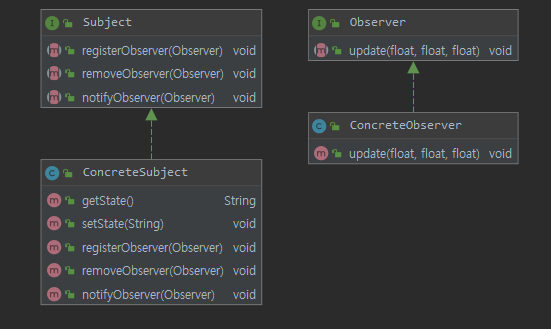
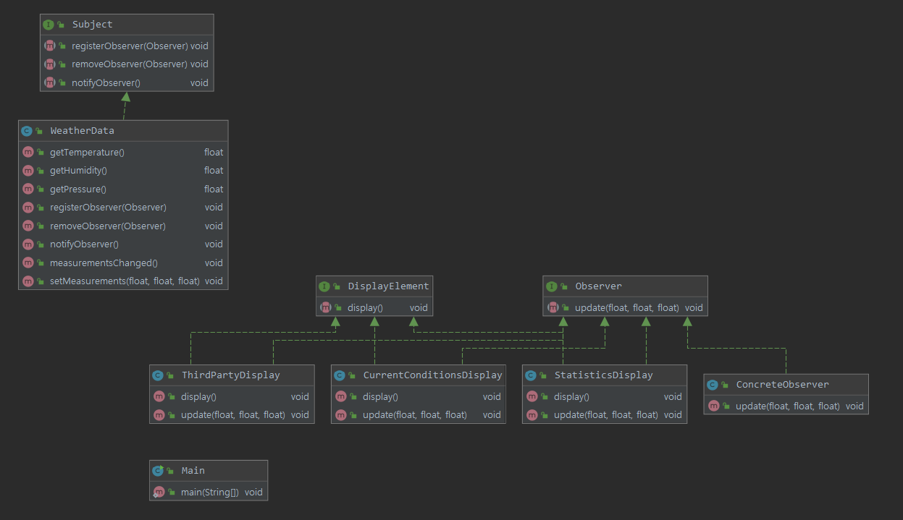
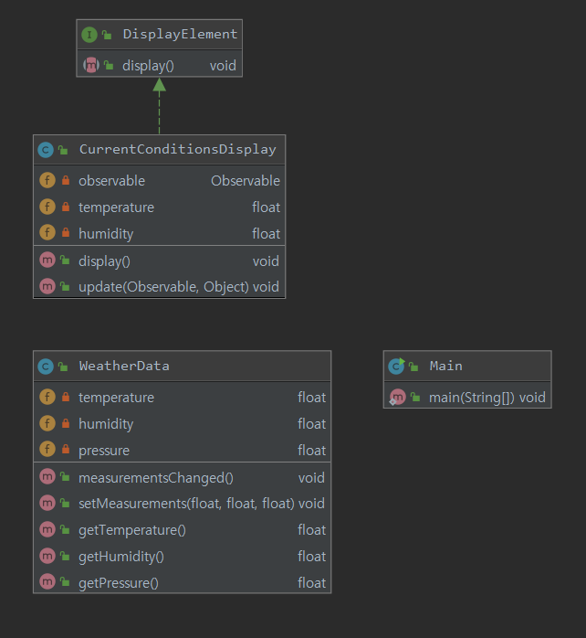

# HeadFirst Design Pattern

## Chapter2. 옵저버 패턴

### 가성 모니터링 애플리케이션

#### 1. 애플리케이션 개요
* WeatherData에는 세가지 측정값이 존재 : 온도, 습도, 기압
* 새로운 가상측정 데이터가 나올 때마다 measurementChanged() 메서드가 호출됨
* measureData 에서 새로운 측정값이 나올 때마다 디스플레이 갱신
* 시스템 확장이 가능해야함

#### 2. 구현과 문제
* 
    * 구체적인 구현에 맞춰 코딩했기 때문에 프로그램을 고치지않고는 다른 디스플레이 항목을 추가제거 불가
    * 모든 call 메서드가 기온 습도 기압을 파라미터로 받음

#### 3. 출판사+구독자 = 옵저버 패턴
* 구독과 출판의 의미
    * 독자가 신문사를 구독하고 있다고 했을 때, 독자는 신문사에서 잡지/신문을 계속해서 받을 수 있음
    * 만약 독자가 중간에 구독해지 한다면 더이상 잡지/신문을 받아볼 수 없음

#### 4. 옵저버 패턴의 정의
* 한객체의 상태가 바뀌면 그 객체에 의존하는 다른 객체들한테 연락이 가고 자동으로 내용이 갱신되는 방식으로 일대다 의존성을 정의

#### 5. 클래스 옵저버 다이어그램
* 
* Subject 가 Observer를 구독하고 있는 형태
* 옵저버가 될 가능성이 있는 객체에서는 Observer 인터페이스를 구현해서 사용. 
* Subject에 notifyObserver 메서드로 상태변화를 감지

#### 6 .느슨한 결합
* 두객체가 느슨하게 결합한다는것은 상호작용을 하지만 서로에 대해 잘 모른다는 것
    * 옵저버는 언제든 새로 추가할 수 있고
    * 새로운 형식의 옵저버를 추가하려고 할 때에도, 주제를 전혀 변경할 필요 없고
    * 주제와 옵저버는 서로 독립적으로 재사용 할 수 있고
    * 주제나 옵저버가 바뀌더라도 서로한테 영향을 미치지 않음
    

#### 7. 가상 스테이션 구현
* 
* Observer를 구현하고 있는 클래스가 Subject를 구현하고 있는클래스를 구독하고 있는 형태

#### 8. JAVA 내장 옵저버 패턴 사용하기
* JAVA 에서 기본적으로 지원하는 java util 이 존재함

*  옵저버한테 연락이 가는 순서에 의존하면 안됨 : 순서 뒤바뀌기 때문
* 옵저버 클래스의 단점
    * Observable 는 클래스
        - 구현이 아닌 상속의 방법을 사용해야 함  - 부모와의 의존성
        - Observable 이 클래스이기 때문에 서브클래스를 만들어야 함. 재사용성에 문제
        - Observable이 인터페이스 라는 것이 없기 때문에 자바에 내장된 Observer API 와 잘 마즌ㄴ 클래스를 직접 구현하는것이 불가능
    * Observable 클래스의 핵심 메서드를 외부에서 호출 불가능
        - setChanged()는 protected로 선언되어 있으며, 상속받은 서브 클래스에서만 사용 가능.
            - (사실 setChanged() 메서드를 외부에서 사용한다는 발상 자체가 디자인 원칙에 위배..       )
            
  
