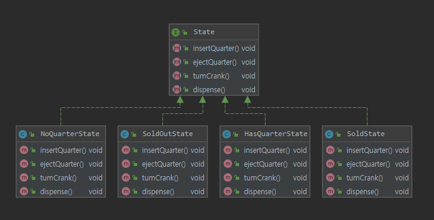

# Design-pattern

## 7. state pattern


#### 애플리케이션
- 행동 전환에 따른 기능 변경

```
final static int SOLD_OUT = 0;
    final static int NO_QUARTER= 1;
    final static int HAS_QUARTER = 2;
    final static int SOLD = 3 ;

    int state = SOLD_OUT;
    int count = 0;

    public GumballMachine_1(int count) {
        this.count = count;
        if (count > 0 ) {
            state = NO_QUARTER;
        }
    }

    public void insertQuarter() {
        if(state == HAS_QUARTER) {
            //...
        }
        else if( state ==NO_QUARTER) {
            ///...
        }
        else if( state == SOLD_OUT) {
            //..
        }
        else {
            //..
        }
    }
....
```

#### 문제점
* 변경 및 기능 추가에 취약
* if 분기가 너무 많아 프로그램이 복잡해짐 -> 컨텍스트 에러 발생 가능성
* 객체 책임 경계가 모호함

#### 해결안
* state인터페이스 정의
* 기계의 모든 상태에 대해 클래스 구현.
* 조건문 전부 없앰


 
* 각 클래스별로 상태를 관리
* 코드 추가 수정이 용이

#### 코드를 객체로
* 어떤 행동이 호출 되면 그행동은 현재 상태에 `맡겨짐`
* 기능 추가시 코드의 수정이 아닌 상태 클래스를 더 추가하여 정의


#### 스테이트 패턴
```text
스테이트 패텬을 이용하면 객체의 내부 상태가 바뀜에 따라서 객체의 행동을 바꿀 수 있습니다.
마치 객체의 클래스가 바뀌는 것과 같은 결과를 얻음
``` 
* 스테이트 객체 변경에 따라 상태를 호출 했을 때 나오는 결과값이 달라진다.
* 코드 레벨이 아닌 객체레벨에서 수정하기 때문에 구성을 통해 상태 객체를 바꾸며 사용할 수 있음


#### 스테이트 패턴 Vs 스트래티지 패턴

스테이트 | 스트레티지 
----|----
상태 객체에 일련의 행동이 캡슐화 됨. 상황에 따라 context객체에서 여러 상태객체중 한 객체에 모든것을 맡김| 클라이언트에게 어떤 전략객체를 사용할 지를 지정해줌. 
서브클래스를 만드는 방법을 대신하여 유연성을 극대화하기 위한 용도로 쓰임 | 구성을 통해 행동을 정의하는 객체를 유연하게 바꿀  수 있음


